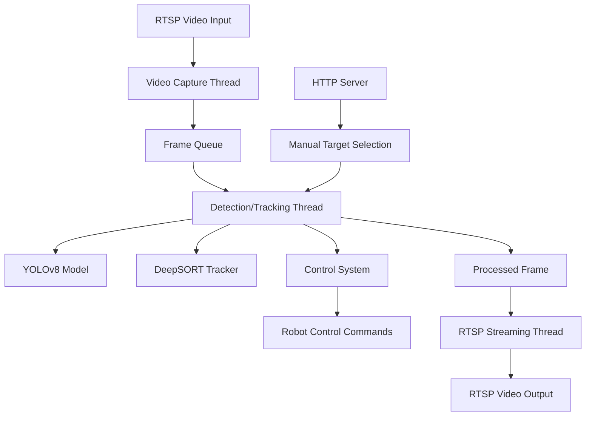

AI-Powered Real-Time Object Tracking System 
 
!
!
!
!
 
An advanced real-time object detection and tracking system using YOLOv8 and DeepSORT, with RTSP video streaming and robot control capabilities.
 
Features 
 
- 🎯 YOLOv8 Object Detection: Real-time detection with customizable confidence thresholds 
- 🔍 DeepSORT Tracking: Robust object tracking across frames 
- 📹 RTSP Streaming: Input/output video stream handling with FFmpeg 
- 🤖 Robot Control: PID-based control system for robotic movement 
- 🌐 HTTP API: REST interface for manual target selection 
- ⚡ Multi-threaded Architecture: Optimized for performance with separate processing threads 
- 📊 Performance Monitoring: Real-time FPS tracking and resource monitoring 
 
System Architecture 
 

 
Requirements 
 
- Python 3.8+
- NVIDIA GPU (for CUDA acceleration)
- FFmpeg (for RTSP streaming)
 
Installation 
 
1. Clone the repository:
```bash 
git clone https://github.com/yourusername/object-tracking-system.git 
cd object-tracking-system 
```
 
2. Install dependencies:
```bash 
pip install -r requirements.txt 
```
 
3. Download YOLOv8 weights:
```bash 
wget https://github.com/ultralytics/assets/releases/download/v0.0.0/yolov8n.pt 
```
 
Configuration 
 
Edit the `Config` class in the main script to set your specific parameters:
 
```python 
@dataclass 
class Config:
    RTSP_INPUT_URL = 'rtsp://your_camera_ip:554/stream'  # Input RTSP stream 
    RTSP_OUTPUT_URL = "rtsp://your_server_ip:25544/yolo" # Output RTSP stream 
    HTTP_SERVER_PORT = 8080                              # API port 
    CONTROL_IP = "192.168.1.120"                         # Robot IP 
    CONTROL_PORT = 43893                                  # Robot control port 
```
 
Usage 
 
1. Start the system:
```bash 
python main.py 
```
 
2. To manually select a target via HTTP API:
```bash 
curl -X POST http://localhost:8080 \
  -H "Content-Type: application/json" \
  -d '{"x": 0.5, "y": 0.5}'
```
 
PID Control Parameters 
 
The system uses enhanced PID controllers for smooth robotic movement:
 
```python 
Yaw (horizontal) control 
yaw_pid = EnhancedPIDController(
    kp=0.003, ki=0.0002, kd=0.0008,
    max_speed=1.0, dead_zone=8 
)
 
Pitch (vertical) control 
pitch_pid = EnhancedPIDController(
    kp=0.0015, ki=0.0002, kd=0.0008,
    max_speed=1.0, dead_zone=8 
)
``` 
 
Performance Optimization 
 
- Dynamic PID parameter adjustment based on error magnitude 
- Frame rate control (target 30FPS)
- Queue-based frame processing to prevent bottlenecks 
- CUDA acceleration for YOLO inference 
 
Troubleshooting 
 
Common issues and solutions:
 
1. RTSP connection failures:
   - Verify camera credentials and network connectivity 
   - Check firewall settings for RTSP ports 
 
2. Low FPS:
   - Reduce input resolution 
   - Use smaller YOLO model (yolov8n instead of yolov8x)
 
3. Tracking instability:
   - Adjust detection confidence threshold 
   - Tune PID parameters 
 
License 
 
MIT License - see  for details.
```
 
You can customize this further by:
1. Adding actual screenshots/videos of the system in action 
2. Including more detailed setup instructions for specific hardware 
3. Adding performance benchmarks 
4. Expanding the API documentation section 
5. Adding a contribution guide 
 
The Mermaid diagram will render automatically in GitHub Markdown if you have Mermaid support enabled in your repository.